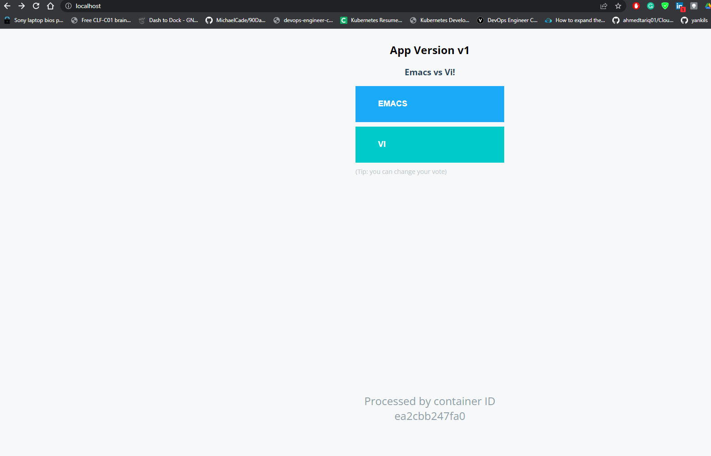

# Vote App Frontend 

This is a frontend app, part of [Example Voting App](https://github.com/schoolofdevops/example-voting-app).  

To build and run this app as a container, 

  * use `python:2.7-alpine` container base image
  * map/expose `container port 80`
  * copy over the source code 
  * run `pip install -r requirements.txt` to install dependencies
  * launch the app with `gunicorn app:app -b 0.0.0.0:80` command


```
docker build -t voting-app .

docker run -ditp 80:80 voting-app
```



  ## This repo was gotten from https://github.com/schoolofdevops
